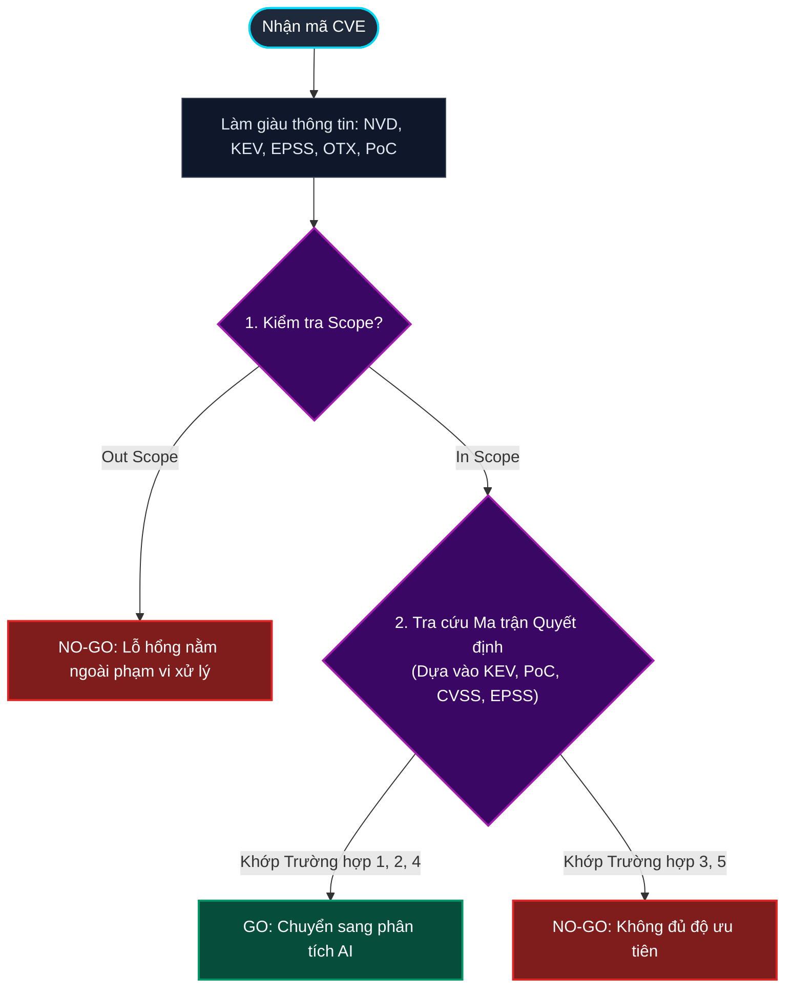

# SƠ ĐỒ LUỒNG VÀ MA TRẬN QUYẾT ĐỊNH TRIAGE CVE (GO / NO-GO)

## 1. SƠ ĐỒ LUỒNG QUYẾT ĐỊNH (FLOWCHART)

Sơ đồ thể hiện luồng đi của dữ liệu CVE thông qua các bộ lọc chính (Scope, KEV, PoC, CVSS, EPSS) để đưa ra kết quả quyết định cuối cùng:

---

## 2. BẢNG MA TRẬN QUYẾT ĐỊNH CHI TIẾT (DECISION MATRIX)

Sau khi xác định CVE nằm trong Scope (`In Scope`), hệ thống sẽ tra cứu dữ liệu theo ma trận sau để đưa ra kết quả quyết định (`Decision`) và mức độ ưu tiên tương ứng (`Priority`):

| Trường hợp | CISA KEV? | Public PoC? | CVSS >= 8.0 hoặc EPSS >= 0.3? | Quyết định | Mức độ ưu tiên | Lý do & Ý nghĩa |
| :--- | :---: | :---: | :---: | :---: | :---: | :--- |
| **TH 1** (Nghiêm trọng) | **Có** | **Có** | **Thỏa mãn** | 🟢 **GO** |  Khẩn cấp (Critical) | Lỗ hổng đang bị khai thác rộng rãi, có sẵn mã khai thác và điểm nguy hiểm cao. |
| **TH 2** (Nguy cơ cao) | Không | **Có** | **Thỏa mãn** | 🟢 **GO** |  Cao (High) | Tuy chưa ghi nhận chiến dịch thực tế nhưng có sẵn PoC công khai và điểm số nguy cơ cao. |
| **TH 4** (Cảnh báo sớm) | **Có** | **Có** | Không thỏa mãn | 🟢 **GO** |  Trung bình (Medium) | Lỗ hổng có KEV và PoC nhưng điểm kỹ thuật hoặc xác suất khai thác còn thấp. |
| **TH 3** (Cần theo dõi) | **Có** | Không | **Thỏa mãn** | 🔴 **NO-GO** |  Trung bình (Medium) | Bị khai thác thực tế và điểm cao, nhưng chưa có mã khai thác công khai nên theo dõi thêm. |
| **TH 5** (Bỏ qua) | *Khác* | *Khác* | *Khác* | 🔴 **NO-GO** |  Thấp (Low) | Không đáp ứng đủ độ nguy hiểm cần thiết để đưa vào diện phân tích sâu. |

---

## 3. CÁC ĐỊNH NGHĨA CHỈ SỐ VÀ NGƯỠNG ĐÁNH GIÁ

*   **In Scope / Out Scope**: Lỗ hổng này có thuộc phạm vi có thể viết luật phát hiện hay không.
*   **CISA KEV (Known Exploited Vulnerabilities)**: Danh mục các lỗ hổng đã bị khai thác thực tế do CISA công bố.
*   **Public PoC**: Mã khai thác công khai được tìm thấy trên NVD analyst tags, OTX, hoặc cơ sở dữ liệu `nomi-sec/PoC-in-GitHub`.
*   **Ngưỡng kỹ thuật**:
    *   `CVSS Score >= 8.0`
    *   `EPSS Score >= 0.3` (Tỷ lệ xác suất bị khai thác thực tế trong vòng 30 ngày lớn hơn hoặc bằng 30%).

---

## 4. VÍ DỤ CVE THỰC TẾ CHO TỪNG TRƯỜNG HỢP

### 1. Trường hợp 1 (GO - Khẩn cấp): CVE-2021-44228 (Log4Shell)
*   **Mô tả**: Lỗi thực thi mã từ xa (RCE) trong Apache Log4j2.
*   **Thông số**: Có KEV | Có PoC | CVSS 10.0 (Thỏa mãn).
*   **Ý nghĩa**: Mối đe dọa cao nhất, chuyển ngay sang AI phân tích và sinh luật.

### 2. Trường hợp 2 (GO - Cao): CVE-2024-38077 (MadLicense - Windows RDP)
*   **Mô tả**: Lỗi RCE trong Windows Remote Desktop Licensing.
*   **Thông số**: Không KEV | Có PoC | CVSS 9.8 (Thỏa mãn).
*   **Ý nghĩa**: Chưa ghi nhận khai thác thực tế diện rộng nhưng nguy cơ cao do có PoC công khai.

### 3. Trường hợp 4 (GO - Trung bình): CVE-2021-3493 (Ubuntu OverlayFS LPE)
*   **Mô tả**: Lỗ hổng leo thang đặc quyền cục bộ trong Ubuntu Linux.
*   **Thông số**: Có KEV | Có PoC | CVSS 7.8, EPSS 0.08 (Không thỏa mãn).
*   **Ý nghĩa**: Quyết định GO vì đã có KEV và PoC, mức ưu tiên ở mức Trung bình.

### 4. Trường hợp 3 (NO-GO - Trung bình): CVE-2023-36884 (Office HTML RCE)
*   **Mô tả**: Lỗi thực thi mã từ xa qua tài liệu Office được nhóm APT RomCom khai thác.
*   **Thông số**: Có KEV | Không PoC | CVSS 8.3 (Thỏa mãn).
*   **Ý nghĩa**: Quyết định NO-GO vì thiếu mã nguồn khai thác (PoC) để phân tích hành vi và viết luật giám sát.

### 5. Trường hợp 5 (NO-GO - Thấp): CVE-2013-0942 (XSS trên RSA Authentication Agent)
*   **Mô tả**: Lỗi Cross-site Scripting cũ trên sản phẩm EMC RSA.
*   **Thông số**: Không KEV | Không PoC | CVSS 4.3 (Không thỏa mãn).
*   **Ý nghĩa**: Bỏ qua để giám sát thụ động do mức độ nghiêm trọng thấp.
