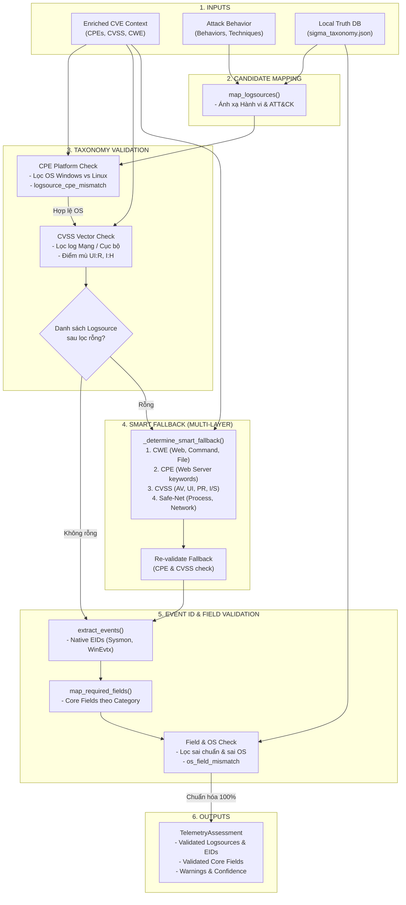

# Kiến Trúc & Luồng Hoạt Động Của Pipeline Thẩm Định (Validation Pipeline — Bước 4 Telemetry)

Tài liệu này mô tả chi tiết toàn bộ cơ chế hoạt động, luồng xử lý và các bước thẩm định chuyên sâu đã được lập trình và triển khai thực tế trong **Bước 4 (Telemetry Stage & Taxonomy Validation)** của nền tảng CVE Threat Intelligence.

---

## 1. Mục tiêu & Triết lý Thiết kế

> [!IMPORTANT]
> **Triết lý "Zero Hallucination — 100% Ontology & OS Compliance"**
> Khi phân tích lỗ hổng (CVE), việc chọn nguồn log (Logsource) và trường dữ liệu (Fields) có thể xảy ra các sai sót như:
> - Đề xuất bật log Linux cho lỗ hổng Windows (sai hệ điều hành).
> - Đề xuất giám sát mạng cho lỗ hổng chỉ khai thác cục bộ không qua mạng.
> - Đề xuất các trường dữ liệu (fields) của Linux trên luật Windows (hoặc tên trường không tồn tại trong chuẩn SigmaHQ).
> 
> **Step 4 Validation Pipeline** ra đời như một **"Trạm kiểm soát an ninh đa lớp (Multi-Layer Ontology Gate)"** nhằm:
> - Thẩm định và lọc bỏ 100% các nguồn log sai hệ điều hành (CPE) và sai vector tấn công (CVSS).
> - Thẩm định và loại bỏ các trường dữ liệu (Fields) sai nền tảng HĐH.
> - Xử lý ngoại lệ thông minh (**Smart Fallback Đa Tầng từ CWE, CPE và CVSS**) để không bao giờ bị rỗng logsource.
> - Chuẩn hóa toàn bộ dữ liệu đầu ra thành `TelemetryAssessment` sẵn sàng cho việc sinh luật **Sigma Rule**.

---

## 2. Sơ đồ Luồng Hoạt Động (Activity Diagram)

Sơ đồ dưới đây thể hiện toàn bộ mạch xử lý thực tế trong hàm `run_telemetry_stage` từ khi tiếp nhận dữ liệu đầu vào cho đến khi ra quyết định cuối cùng:

---

## 3. Chi Tiết Toàn Bộ Các Cơ Chế Thẩm Định Đã Triển Khai

Dưới đây là chi tiết kỹ thuật của từng lớp thẩm định đang chạy trong hệ thống:

### 🔹 Lớp 1: Thẩm định Nền tảng Hệ điều hành (`validate_logsources_by_cpe`)
- **Mục đích:** Ngăn chặn tuyệt đối việc bật giám sát log của nền tảng này cho lỗ hổng của nền tảng khác.
- **Cơ chế xử lý:**
  - Trích xuất hệ điều hành từ danh sách **CPE** (`windows`, `linux`, `macos`).
  - Đối chiếu với thuộc tính `product` của từng Logsource Category trong từ điển `sigma_taxonomy.json`.
  - **Quy tắc gạt bỏ:**
    - Nếu CPE chỉ có `Linux` nhưng Logsource có `product="windows"` ➔ **Loại bỏ ngay lập tức**, ghi cảnh báo `logsource_cpe_mismatch`.
    - Nếu CPE chỉ có `Windows` nhưng Logsource có `product="linux"` ➔ **Loại bỏ ngay lập tức**, ghi cảnh báo `logsource_cpe_mismatch`.
    - Các Logsource trung lập không gắn cứng OS sẽ luôn được bảo lưu.

### 🔹 Lớp 2: Thẩm định theo CVSS Vector Đa chiều (`validate_logsources_by_cvss`)
- **Mục đích:** Đảm bảo Logsource được chọn phản ánh đúng con đường tấn công và mức độ tác động của lỗ hổng.
- **Cơ chế xử lý 3 bộ kiểm tra:**
  1. **Kiểm tra Attack Vector (AV):**
     - Các Logsource thuộc nhóm Mạng (`network_connection`, `webserver`, `dns_query`).
     - Nếu lỗ hổng chỉ khai thác cục bộ/vật lý (`AV:L` hoặc `AV:P`) ➔ **Loại bỏ toàn bộ log mạng**, ghi cảnh báo `cvss_av_mismatch`.
     - Ngược lại, nếu lỗ hổng tấn công từ xa (`AV:N` hoặc `AV:A`) nhưng chưa chọn log mạng ➔ Ghi cảnh báo nhắc nhở `cvss_av_missing_network`.
  2. **Kiểm tra tương tác người dùng (`UI:R`):**
     - Nếu CVSS Vector chỉ ra yêu cầu nạn nhân tương tác (`UI:R` - như lừa đảo, mở file đính kèm), hệ thống kiểm tra xem có Logsource phía Client (`process_creation`, `file_event`, `image_load`) hay không.
     - Nếu thiếu ➔ Ghi cảnh báo `cvss_ui_missing_client_logs` để báo cáo điểm mù giám sát Phishing/Payload.
  3. **Kiểm tra tính toàn vẹn hệ thống (`I:H` / `VI:H`):**
     - Nếu CVSS Vector gây phá hoại toàn vẹn mức cao (`I:H` / `VI:H`), hệ thống kiểm tra xem có Logsource theo dõi thay đổi trạng thái (`file_change`, `file_delete`, `registry_event`, `process_creation`) hay không.
     - Nếu thiếu ➔ Ghi cảnh báo `cvss_integrity_missing_monitoring`.

### 🔹 Lớp 3: Thẩm định & Lọc Trường Dữ Liệu theo HĐH (`validate_fields_by_logsources`)
- **Mục đích:** Khi xuất danh sách `Required Core Fields`, hệ thống phải loại bỏ các trường không hợp lệ hoặc các trường vi phạm hệ điều hành mục tiêu.
- **Cơ chế xử lý:**
  1. **Kiểm tra từ điển chuẩn (`LOGSOURCE_FIELDS`):**
     - Chỉ giữ lại các trường thuộc tập hợp `allowed_fields` của các Logsource đã vượt qua Lớp 1 và Lớp 2.
     - Trường lạ không thuộc chuẩn SigmaHQ bị gạt bỏ kèm cảnh báo `invalid_field_removed`.
  2. **Kiểm tra chéo nền tảng HĐH (`OS_SPECIFIC_FIELDS`):**
     - Xác định `target_products` của các Logsource hiện tại.
     - Kiểm tra trong bảng `OS_SPECIFIC_FIELDS` (quy định rõ trường nào CHỈ dùng cho Windows, trường nào CHỈ dùng cho Linux).
     - Nếu một trường Linux (ví dụ của Auditd) xuất hiện trong quy tắc cho Windows ➔ **Loại bỏ trường đó**, ghi cảnh báo `os_field_mismatch`.

---

## 4. Cơ Chế Chống Rỗng: Smart Fallback Đa Tầng (`_determine_smart_fallback`)

Khi lỗ hổng quá mới hoặc chưa đủ thông tin khiến danh sách Logsource sau khi lọc bị rỗng, hệ thống kích hoạt **Smart Fallback Engine** tự động suy luận và bổ sung Logsource qua **3 tầng Heuristics (CWE, CPE, CVSS)** và 1 lớp Safe-Net:

### 4.1. Tầng 1: CWE Heuristics (Dựa vào Loại Điểm Yếu Phần Mềm)
Hệ thống kiểm tra danh sách mã CWE của lỗ hổng (`cwe_ids`) để bổ sung chính xác Logsource tương ứng:

| Nhóm lỗi CWE | Tên mã lỗi | Logsource tự động bổ sung |
| :--- | :--- | :--- |
| **Nhóm Web & Injection** | `CWE-89` (SQLi), `CWE-79` (XSS), `CWE-22` (Path Traversal), `CWE-352` (CSRF), `CWE-611` (XXE), `CWE-94` (Code Injection) | **`webserver`** |
| **Nhóm Thực thi Lệnh & Đặc quyền** | `CWE-78` (OS Command Injection), `CWE-502` (Deserialization), `CWE-269` (Improper Privilege Management) | **`process_creation`** |
| **Nhóm Tải File Độc Hại** | `CWE-434` (Unrestricted Upload of File with Dangerous Type) | **`file_event`**, **`webserver`** |

### 4.2. Tầng 2: CPE Heuristics (Dựa vào Từ Khóa Phần Mềm)
Hệ thống quét chuỗi định danh **CPE** của hệ thống bị ảnh hưởng:
- Nếu chứa các từ khóa máy chủ Web/Ứng dụng: `apache`, `nginx`, `iis`, `tomcat`, `wordpress`, `php`, `f5`, `citrix`, `weblogic`...
- ➔ Tự động bổ sung Logsource **`webserver`**.

### 4.3. Tầng 3: CVSS Multi-Metric Heuristics (4 Chiều Vector Tấn Công)
Hệ thống phân tích đồng thời 4 chỉ số trong `CVSS Metrics`:

| Chiều phân tích CVSS | Giá trị Metric | Logsource tự động bổ sung | Lý do kỹ thuật |
| :--- | :--- | :--- | :--- |
| **1. Attack Vector (AV)** | `AV:N` hoặc `AV:A` `AV:L` hoặc `AV:P` | `network_connection` `process_creation` | Khai thác qua mạng cần log kết nối. Khai thác cục bộ cần log chạy tiến trình. |
| **2. User Interaction (UI)** | `UI:R` (Yêu cầu tương tác) | `file_event`, `process_creation` | Nạn nhân mở file tải về hoặc chạy script độc hại. |
| **3. Privileges Required (PR)** | `PR:L` hoặc `PR:H` `PR:N` + `AV:N` | `authentication`, `process_creation` `webserver`, `network_connection` | Khai thác leo thang quyền hạn. Tấn công dịch vụ web/server từ xa không cần authen. |
| **4. Integrity & Scope (I, S)** | `I:H` hoặc `VI:H` `S:C` (Changed Scope) | `file_event`, `file_change` (+ `registry_event` nếu Windows) `process_creation`, `network_connection` | Giám sát thay đổi file/registry khi bị ghi đè. Giám sát tiến trình con nhảy sang scope khác. |

### 4.4. Safe-Net Mặc Định
- Nếu cả 3 tầng Heuristics trên vẫn không xác định được Logsource (trường hợp cực kỳ hiếm):
- ➔ Hệ thống tự động gán **`process_creation`** và **`network_connection`** (2 Logsource cốt lõi luôn có giá trị giám sát cao nhất trên mọi hệ thống).

---

## 5. Ví Dụ Minh Họa Luồng Thẩm Định Thực Tế (Case Studies)

### 🔴 Kịch bản 1: Log4Shell (`CVE-2021-44228` — Multi-Platform RCE)
- **Đầu vào:** Apache Log4j (Đa nền tảng Windows/Linux), `AV:N`, `UI:N`, `I:H`, `CWE-94` (Code Injection).
- **Luồng xử lý:**
  - **Lọc CPE:** Nhận diện cả Windows và Linux ➔ Giữ nguyên logsource 2 nền tảng.
  - **Lọc CVSS:** `AV:N` ➔ Hợp lệ với `network_connection`; `I:H` ➔ Có sẵn `file_event`, không bị cảnh báo điểm mù.
  - **Lọc Fields:** Cấp phát chính xác các Core Fields (`CommandLine`, `Image`, `DestinationIp`, `User`...) hợp lệ với cả 2 OS.
- **Kết quả:** `process_creation`, `network_connection`, `file_event` ➔ **Telemetry Score: 0.96 (Confidence: High)**.

### 🔴 Kịch bản 2: Dirty Pipe (`CVE-2022-0847` — Linux Kernel Local Privilege Escalation)
- **Đầu vào:** `cpe:2.3:o:linux:linux_kernel`, `AV:L`, `UI:N`, `I:H`, `CWE-269` (Improper Privilege Management).
- **Tình huống giả định:** Đầu vào đề xuất giám sát `registry_event` (Windows) và `network_connection` (Mạng).
- **Luồng xử lý:**
  - **Lọc CPE:** Phát hiện `registry_event` là thuộc Windows không khớp CPE Linux ➔ **Loại bỏ `registry_event`** (`logsource_cpe_mismatch`).
  - **Lọc CVSS:** Phát hiện `AV:L` (khai thác cục bộ) nhưng lại có log mạng ➔ **Loại bỏ `network_connection`** (`cvss_av_mismatch`).
  - **Lọc Fields:** Loại bỏ bất kỳ trường Windows Registry nào, chỉ giữ trường hợp lệ của Linux Auditd (`TargetFilename`, `Image`, `CommandLine`).
- **Kết quả:** Chỉ giữ lại `process_creation` (Auditd) và `file_change` ➔ **Telemetry Score: 0.92 (Confidence: High)**.
